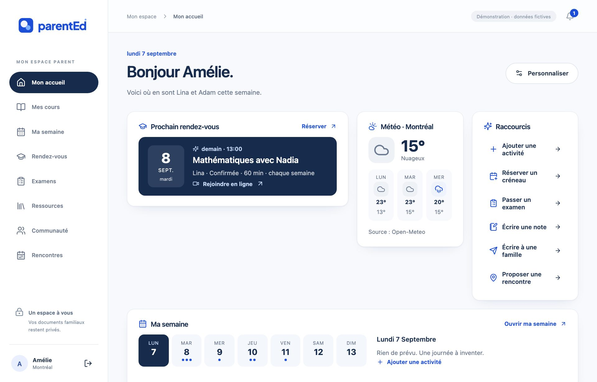
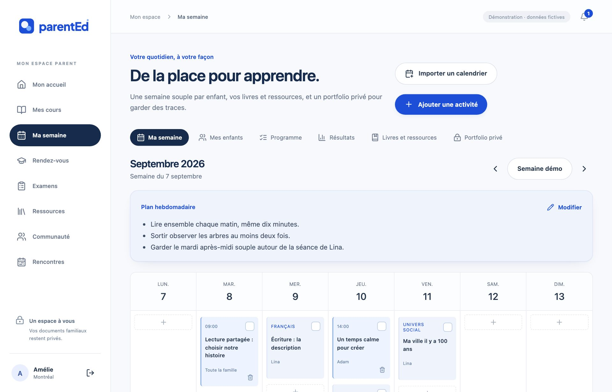
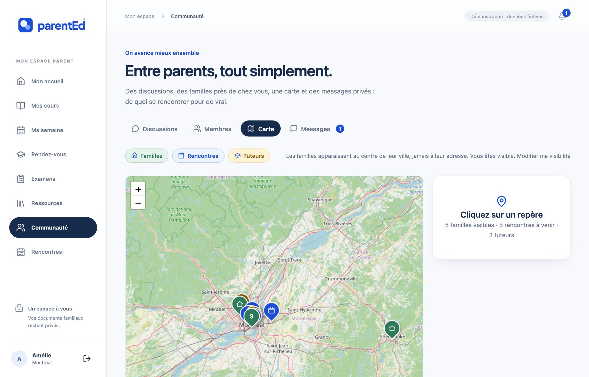
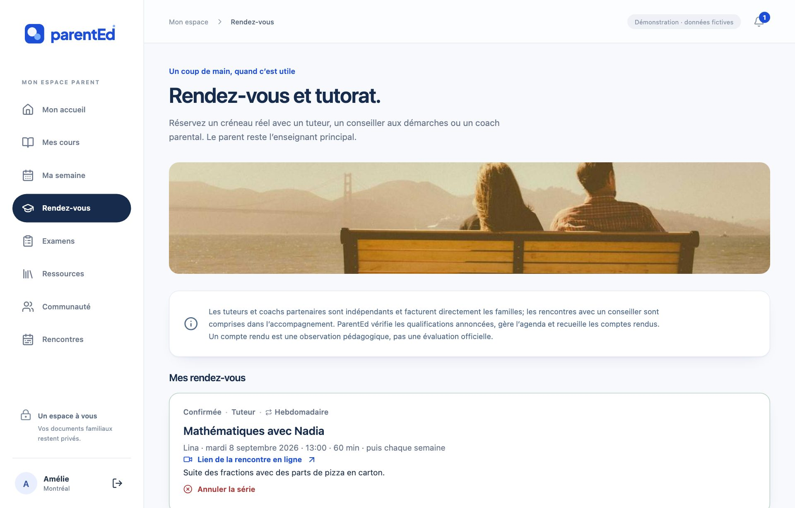
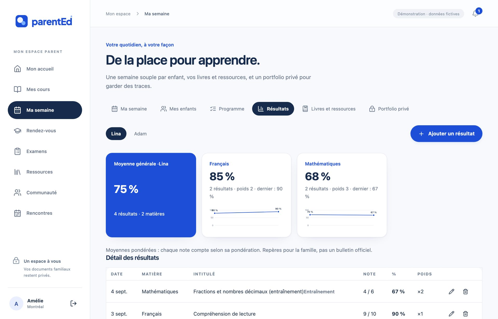

<p align="center">
  
</p>

<h1 align="center">ParentEd</h1>

<p align="center"><strong>L'école à la maison, sans être seul.</strong><br>
Plateforme d'accompagnement des parents-éducateurs du Québec : cours pour parents, ressources officielles expliquées, organisation familiale, communauté locale, rencontres, tutorat sur rendez-vous et examens d'entraînement, dans un seul espace.</p>

<p align="center">
  <a href="https://parented.parented.workers.dev">Site en ligne</a> ·
  <a href="#-démonstration">Démonstration</a> ·
  <a href="#-fonctionnalités">Fonctionnalités</a> ·
  <a href="#-architecture">Architecture</a> ·
  <a href="docs/demo-jury.md">Guide de démonstration pour le jury</a>
</p>

<p align="center">
  
</p>

> **English summary.** ParentEd is a French-language member platform for Québec homeschooling parents. It tackles the five problems families report most: isolation, uncertainty about the official steps, scattered resources, subjects that get stuck, and mental load. In one space it offers courses for parents, explained official resources, family organization (weekly plan, curriculum tracking, portfolio, weighted grades, calendar import), a local community (groups, member directory, interactive map, private messages), meetups, real-slot booking with tutors/advisors/coaches, practice exams, and an assistant. Built with React + TypeScript + Vite on Cloudflare Workers, Supabase (PostgreSQL, Auth, Storage, Edge Functions) with row-level security tested in real PostgreSQL. Live site, demo profiles and setup instructions below. The public landing page has an FR/EN switch.

---

## Sommaire

1. [Le problème](#-le-problème)
2. [La solution](#-la-solution)
3. [Fonctionnalités](#-fonctionnalités)
4. [Captures d'écran](#-captures-décran)
5. [Démonstration](#-démonstration)
6. [Architecture](#-architecture)
7. [Sécurité et vie privée](#-sécurité-et-vie-privée)
8. [Modèle d'affaires](#-modèle-daffaires)
9. [Installation et déploiement](#-installation-et-déploiement)
10. [Tests et qualité](#-tests-et-qualité)
11. [État du projet, limites et feuille de route](#-état-du-projet-limites-et-feuille-de-route)
12. [Documentation](#-documentation)
13. [Crédits](#-crédits)

---

## 🎯 Le problème

Enseigner à la maison est un beau choix. Le faire seul est épuisant. Les familles québécoises décrivent, encore et encore, les mêmes difficultés :

| Difficulté | Ce que vivent les parents |
| --- | --- |
| **« Et la socialisation ? »** | Trouver d'autres familles près de chez soi, des sorties régulières et des amis pour les enfants dépend de la chance et des groupes Facebook. |
| **L'incertitude des démarches** | Avis annuel, projet d'apprentissage, bilans, épreuves ministérielles : le cadre est précis mais dispersé; on avance en craignant d'avoir manqué quelque chose. |
| **Des ressources partout, et nulle part** | PDF gouvernementaux, blogues, forums : des heures de recherche sans savoir ce qui est fiable ni à jour. |
| **Une matière qui bloque** | Il faut parfois un coup de main extérieur, sans renoncer à enseigner soi-même. |
| **Le temps et la charge mentale** | Planifier, garder des traces, préparer les bilans, tout en vivant, sans outil pensé pour la famille. |

Le brief du challenge demandait aussi de répondre à des questions de modèle d'affaires : qui paie, combien, la viabilité après l'année 1, qui enseigne, combien d'enfants ensemble, un mardi type, l'adaptation à d'autres environnements. Les réponses sont dans [docs/demo-jury.md](docs/demo-jury.md) et résumées plus bas.

## 💡 La solution

**Un seul espace** qui relie six volets, en laissant au parent la responsabilité éducative. ParentEd n'est ni une école, ni un service de garde, ni une garantie de conformité : les sources officielles du ministère font foi, et la plateforme les rend lisibles.

| Volet | Ce que ParentEd apporte |
| --- | --- |
| Formation des parents | Cours originaux courts avec exemples, exercices, modèles réutilisables, notes personnelles et questions à l'équipe |
| Ressources officielles expliquées | Liens gouvernementaux accompagnés de nos repères, datés, classés par étape, avec favoris |
| Organisation familiale | Semaine par enfant, programme importé et réparti sur les jours d'école, portfolio privé, résultats pondérés, import de calendrier |
| Communauté | Groupes régionaux et thématiques, annuaire des familles, carte interactive, messages privés, notifications |
| Rencontres | Liste, calendrier et carte, filtres, récurrence, propositions des membres vérifiées par l'équipe, rappels |
| Tutorat et rendez-vous | Tuteurs, conseillers aux démarches et coachs avec créneaux réels, réservation confirmée, compte rendu pédagogique, avis |
| Examens d'entraînement | Examens chronométrés et corrigés, résultats suivis par enfant |
| Assistant | Recherche dans les contenus de ParentEd; réponses en langage naturel avec Claude lorsque configuré, sous quotas |

## ✨ Fonctionnalités

### Pour les parents
- **Accueil en widgets** personnalisables : prochain rendez-vous avec compte à rebours, agenda de la semaine, météo de la ville, progrès des enfants (anneaux et courbes), programme par matière, cours en cours, prochaine rencontre, communauté, portfolio, raccourcis.
- **Mes cours** : modules, exercices, modèles à copier ou télécharger, lien vidéo, note personnelle par leçon, questions avec réponses publiques de l'équipe, progression persistante.
- **Ma semaine** : activités par enfant, plan hebdomadaire d'intentions, fiches enfants, livres et ressources, **programme** (import CSV ou texte, répartition automatique, % couvert par matière), **résultats** (notes pondérées, moyennes, courbes, examens intégrés), **portfolio privé** (notes datées et fichiers avec contexte), **import de calendrier .ics** (Google, Apple, Outlook), export JSON.
- **Rendez-vous** : annuaire de tuteurs, conseillers et coachs vérifiés; calendrier de créneaux réels calculé à partir des disponibilités; réservation confirmée immédiatement (la base refuse un créneau pris ou hors disponibilité); lien de rencontre en ligne; compte rendu; avis; courriel de confirmation optionnel.
- **Examens** : examens d'entraînement chronométrés, correction avec explications, résultat par enfant converti en note.
- **Ressources** : recherche, étapes, favoris, source et date de vérification.
- **Communauté** : discussions avec réactions et épinglage, groupes, **annuaire** avec recherche par ville et intérêt, **carte interactive** (familles par ville sur choix explicite, rencontres, tuteurs), **messages privés**, notifications en application.
- **Rencontres** : liste, calendrier, carte, filtres (région, semaine ou week-end, gratuit, mes inscriptions), annonces à la une, récurrence, nombre de familles inscrites, propositions par les membres avec choix du lieu sur la carte, rappel iCalendar.
- **Profil** : prénom, ville, âges des enfants sans prénom, intérêts, visibilité sur la carte.
- **Comptes** : inscription, confirmation par courriel, réinitialisation du mot de passe, acceptation des conditions.

### Pour l'équipe (administration)
- Tableau de bord : à traiter (signalements, propositions, questions, profils), activité sur 8 semaines, indicateurs, familles par ville, usage et coût de l'assistant avec interrupteur.
- Gestion des cours, leçons, ressources, groupes, rencontres (dont publication des propositions), tuteurs et disponibilités, examens et questions, séances, signalements, demandes de contact reçues depuis la page publique.

### Page publique
- Page d'accueil animée (héros en couches avec parallaxe), problème, solution, captures réelles de la plateforme, offre et tarif, FAQ, réservation d'appel et liste des familles fondatrices, mentions légales, bouton FR / EN.

## 🖼 Captures d'écran

| Ma semaine | Carte de la communauté |
| --- | --- |
|  |  |

| Rendez-vous | Résultats |
| --- | --- |
|  |  |

## 🧪 Démonstration

**Site en ligne :** https://parented.parented.workers.dev

Sur la page publique, « Voir la démonstration » (ou `#connexion`) ouvre quatre profils fictifs, sans compte. Les données de démonstration restent dans le navigateur.

| Profil | Rôle | Ce qu'il montre |
| --- | --- | --- |
| **Amélie** | Parent (Lina, 8 ans; Adam, 6 ans) | Semaine, programme, résultats, portfolio, séance de tutorat, communauté |
| **Sami** | Parent d'une autre famille | Isolation des données entre familles |
| **Nadia** | Tutrice | Espace tuteur : demandes, confirmation, comptes rendus |
| **Camille** | Administration | Tableau de bord d'équipe, gestion des contenus, modération |

Parcours de démonstration détaillé et réponses au brief : [docs/demo-jury.md](docs/demo-jury.md).

**En local :**

```sh
npm ci
cp .env.example .env.local
npm run dev
```

Ouvrir http://127.0.0.1:5173. Sans configuration Supabase, seule la démonstration est active.

## 🏗 Architecture

```
React 19 + TypeScript + Vite  ──►  Cloudflare Workers (Static Assets, SPA)
        │
        ├── Supabase Auth (courriel / mot de passe, confirmation, réinitialisation)
        ├── Supabase PostgreSQL (schéma versionné, RLS famille par famille, vues, déclencheurs)
        ├── Supabase Storage (bucket privé « family-documents », 5 Mo, PDF/PNG/JPEG)
        └── Supabase Edge Functions
              ├── booking-email  (courriel de confirmation via Resend, optionnel)
              └── assistant      (Claude API avec quotas et journal d'usage, optionnel)

Services externes sans clé : OpenStreetMap (tuiles de carte), Open-Meteo (météo).
```

**Structure du dépôt**

| Chemin | Contenu |
| --- | --- |
| `src/domain.ts` | Types et règles métier indépendantes du fournisseur (récurrence, créneaux, pondération, analyse .ics, iCalendar) |
| `src/data/` | `gateway.ts` contrat de données, `supabase.ts` seuls appels Supabase, `demo.ts` simulateur local avec les mêmes règles d'accès, `seed.ts` données fictives |
| `src/components/` | Dashboard, Courses, Family, Social (ressources, rencontres), Community, MapView, Tutoring, Exams, Profile, Assistant, Admin, Landing, Legal |
| `src/legal.ts`, `src/landing-text.ts` | Mentions légales (projets), textes FR/EN de la page publique |
| `supabase/migrations/` | Huit migrations versionnées; `supabase/parented-complet.sql` généré par `npm run sql:bundle` |
| `supabase/functions/` | Fonctions Edge `booking-email` et `assistant` |
| `tests/` | Tests métier (Vitest) et tests SQL exécutant les migrations réelles dans PostgreSQL (PGlite) |
| `scripts/` | Génération du seed, comptes locaux, bundle SQL, captures d'écran (Playwright) |
| `docs/` | Idée du service, décisions, modèle d'affaires, cadre juridique, déploiement, recette, jury |

**Modèle de données (principal) :** familles et profils (rôles parent / tuteur / admin), cours et leçons, progression, notes et questions de leçon, tâches, enfants, plans hebdomadaires, programmes et éléments, notes de portfolio, documents, résultats pondérés, ressources et favoris, discussions, réponses, réactions, groupes et adhésions, messages privés, notifications, rencontres et inscriptions, tuteurs, disponibilités, réservations, comptes rendus, avis, examens, questions et tentatives, usage de l'assistant, réglages, demandes de contact.

## 🔒 Sécurité et vie privée

- **Isolation famille par famille dans la base** : règles RLS PostgreSQL sur chaque table; l'administration voit les contenus publiés et la coordination, jamais l'espace familial (enfants, planning, portfolio, résultats).
- **Rôles attribués en base** par un opérateur, jamais depuis le client (droits de colonnes : rôle et famille immuables).
- **Fichiers privés** sans URL publique; identité des auteurs dérivée du compte par déclencheur.
- **Réservations** validées par déclencheur : pas de double réservation, pas de créneau hors disponibilité.
- **Assistant** : clé côté serveur, quotas par membre et global, cadence minimale, interrupteur d'équipe, refus des données sensibles, aucun outil, aucune donnée familiale transmise; conditions précisant qu'il n'engage pas ParentEd.
- **Demandes publiques** limitées par courriel et par jour; champ piège contre les robots.
- **Navigateur** : en-têtes de sécurité et CSP stricte (`public/_headers`).
- **Mentions légales** dans l'application : confidentialité (Loi 25), témoins, conditions, paiement et remboursement; acceptation à l'inscription. Liste de contrôle : [docs/juridique.md](docs/juridique.md).

## 💼 Modèle d'affaires

Hypothèses de travail, détaillées dans [docs/ParentEd-modele-operationnel-et-financier.md](docs/ParentEd-modele-operationnel-et-financier.md) et [docs/ParentEd-couts-techniques-et-equipe.md](docs/ParentEd-couts-techniques-et-equipe.md).

- **Qui paie :** les familles, par abonnement mensuel sans engagement; tarif de lancement prévu de 49 $ par mois. Phase pilote gratuite pour 50 familles fondatrices. Aucun paiement dans l'application pour l'instant.
- **Tutorat :** intervenants indépendants qui facturent directement les familles (45 à 65 $ l'heure); ParentEd vérifie, planifie et recueille les comptes rendus, sans commission au lancement.
- **Coûts annuels récurrents :** environ 78 000 $ (coordination, pédagogie, technique, juridique, acquisition, réserve); seuil de viabilité autour de 139 familles payantes moyennes.
- **Qui enseigne :** le parent; l'équipe pédagogique conçoit les cours pour parents; les tuteurs interviennent sur certaines matières, en séances individuelles.
- **Adaptation :** socle commun réutilisable; contenus, démarches, langue et intervenants adaptés territoire par territoire.

## 🚀 Installation et déploiement

Guide complet, pas à pas : [docs/deploiement.md](docs/deploiement.md).

1. Créer un projet Supabase et exécuter `supabase/parented-complet.sql` dans SQL Editor (migrations et contenus fictifs; section seed supprimable).
2. Configurer Authentication (Site URL, Redirect URLs, mot de passe de 12 caractères).
3. Renseigner `.env.production` avec l'URL du projet et la clé publishable (publique par conception).
4. `npx wrangler login` puis `npm run deploy`.
5. Nommer les rôles admin et tuteur en base. Optionnel : fonctions `booking-email` (Resend) et `assistant` (Claude) avec leurs secrets.

Commandes utiles :

```sh
npm run dev              # serveur de développement
npm run build            # compilation TypeScript + Vite
npm test                 # tests métier et SQL
npm run check:cloudflare # build + wrangler deploy --dry-run
npm run sql:bundle       # régénère seed.sql et parented-complet.sql
node scripts/capture-screens.mjs   # captures d'écran de la démo (serveur lancé)
```

## ✅ Tests et qualité

- **45 tests** : 15 tests métier et simulateur (persistance, isolation, tutorat, récurrence, iCalendar, pondération, import de calendrier, messages, notifications, profil) et **30 tests PostgreSQL** qui exécutent les huit migrations réelles dans PGlite et vérifient les règles d'accès (familles, fichiers, réservations, comptes rendus, favoris, groupes, questions, propositions, annuaire, messages, avis, examens, programme, quotas, demandes de contact).
- TypeScript strict, Prettier, build Vite et dry-run Cloudflare.
- Parcours vérifiés dans le navigateur sur ordinateur et mobile; animations désactivées avec `prefers-reduced-motion`.
- Limite : les tests SQL représentent Auth et Storage par des schémas minimaux; la recette sur Supabase réel est décrite dans [docs/recette.md](docs/recette.md).

## 🗺 État du projet, limites et feuille de route

**Opérationnel :** tout ce qui est décrit ci-dessus, en démonstration locale et sur le site publié relié à Supabase.

**Limites assumées de cette phase :**
- aucun paiement dans l'application; contenus pédagogiques et fiches d'intervenants de démonstration à remplacer;
- courriels de confirmation et assistant IA dépendent de clés optionnelles (Resend, Anthropic);
- chargement plafonné à 1 000 lignes par table, sans pagination; une famille par compte;
- espace membre et mentions légales en français seulement (page publique FR/EN);
- mentions légales à compléter et à faire relire avant lancement public.

**Feuille de route :** pilote avec 50 familles fondatrices, contenus pédagogiques validés, intervenants réels, SMTP dédié, suppression de compte en libre-service, paiement par abonnement, pagination et temps réel, puis adaptation à d'autres territoires.

Historique détaillé : [docs/progress.md](docs/progress.md).

## 📚 Documentation

| Document | Contenu |
| --- | --- |
| [docs/idee-du-service.md](docs/idee-du-service.md) | Mission et périmètre |
| [docs/demo-jury.md](docs/demo-jury.md) | Parcours de démonstration et réponses au brief |
| [docs/ParentEd-modele-operationnel-et-financier.md](docs/ParentEd-modele-operationnel-et-financier.md) | Modèle opérationnel et financier |
| [docs/ParentEd-couts-techniques-et-equipe.md](docs/ParentEd-couts-techniques-et-equipe.md) | Coûts techniques, équipe, tuteurs |
| [docs/ParentEd-decisions-et-concessions.md](docs/ParentEd-decisions-et-concessions.md) | Décisions d'architecture |
| [docs/references-et-cadre-du-service.md](docs/references-et-cadre-du-service.md) | Références gouvernementales et cadre |
| [docs/juridique.md](docs/juridique.md) | Liste de contrôle juridique (Loi 25, LPC) |
| [docs/deploiement.md](docs/deploiement.md) | Déploiement Supabase et Cloudflare |
| [docs/recette.md](docs/recette.md) | Protocole de recette |
| [docs/sauvegarde-et-restauration.md](docs/sauvegarde-et-restauration.md) | Sauvegardes |
| [docs/direction-marque-et-produit.md](docs/direction-marque-et-produit.md) | Marque et produit |
| [docs/credits-photos.md](docs/credits-photos.md) | Crédits des photographies |

## 🙏 Crédits

- Logotype et identité ParentEd : fournis par le porteur du projet (`brand/`).
- Photographies : licence Unsplash via Lorem Picsum, auteurs listés dans [docs/credits-photos.md](docs/credits-photos.md).
- Cartes : © contributeurs OpenStreetMap. Météo : Open-Meteo.
- Icônes : Lucide. Carte : Leaflet.
- Les profils, familles, tuteurs, rencontres et contenus de démonstration sont fictifs et identifiés comme tels.

Licence du code : à définir par le porteur du projet avant diffusion publique.
